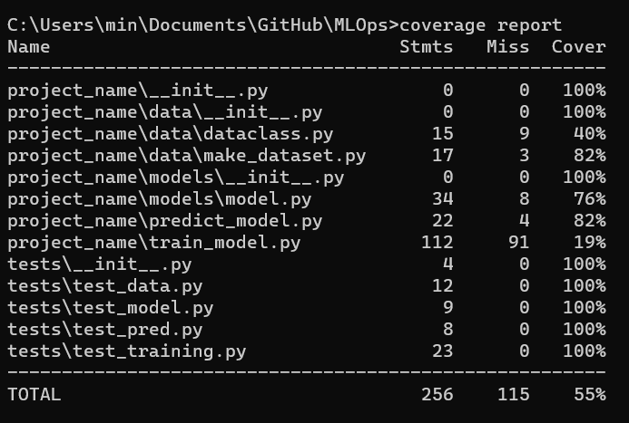
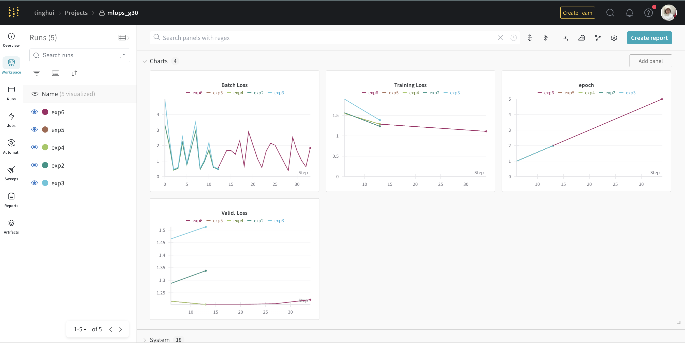
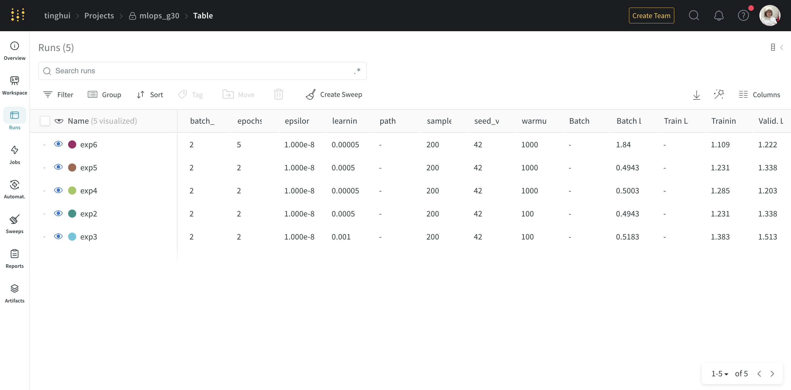
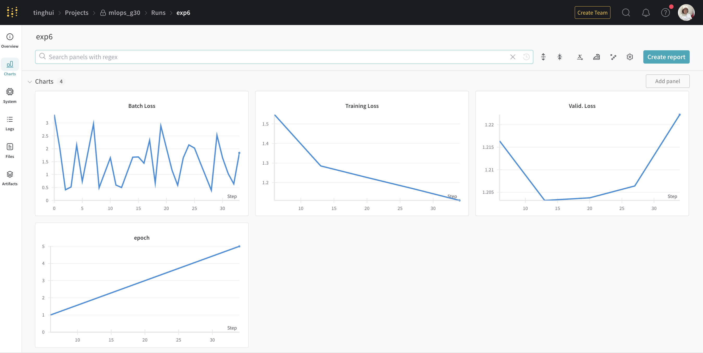
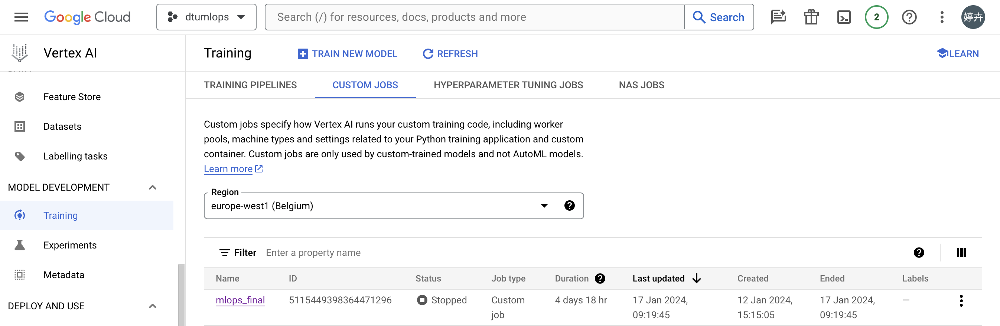
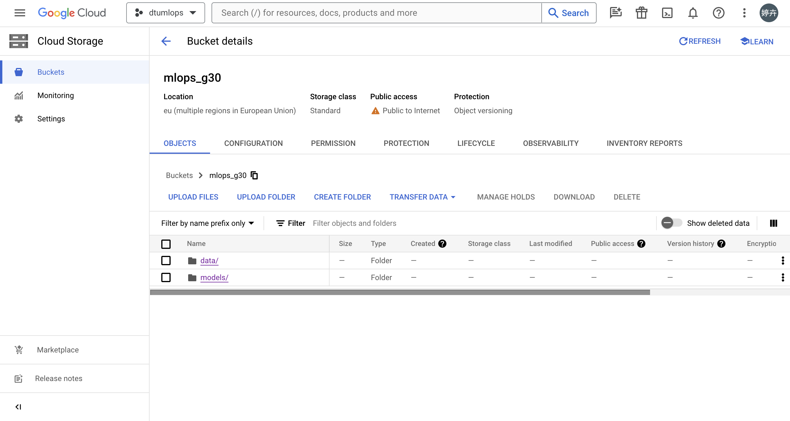
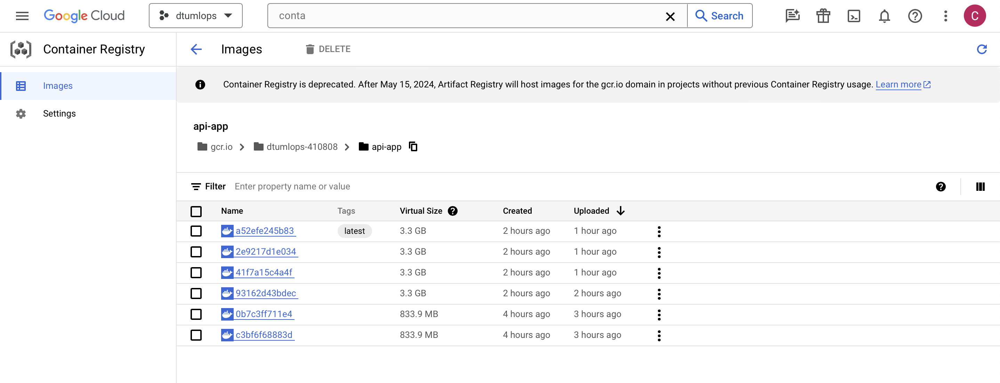
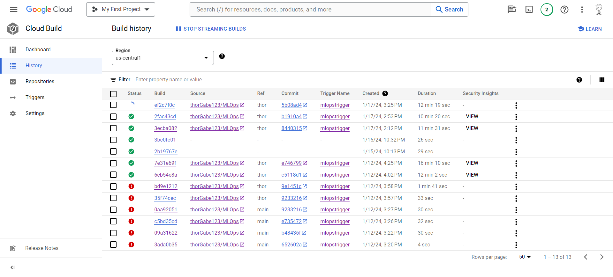
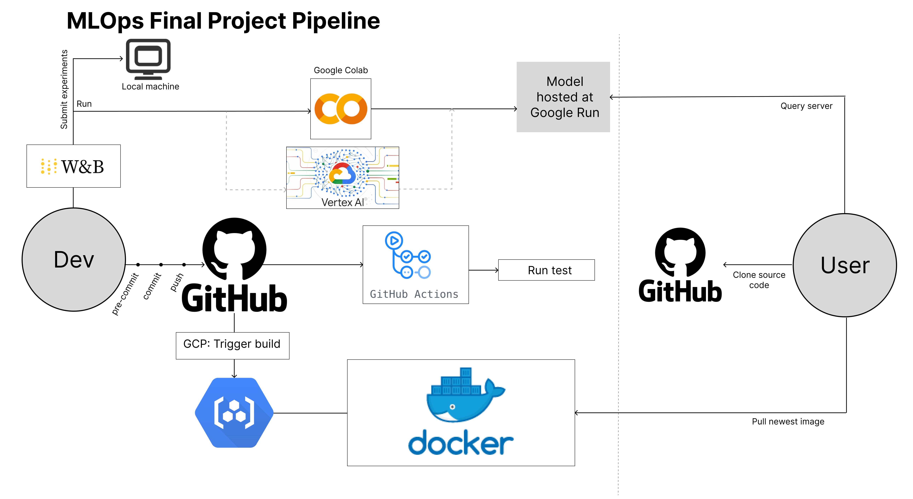

# Exam template for 02476 Machine Learning Operations

This is the report template for the exam. Please only remove the text formatted as with three dashes in front and behind
like:

```--- question 1 fill here ---```

where you instead should add your answers. Any other changes may have unwanted consequences when your report is auto
generated in the end of the course. For questions where you are asked to include images, start by adding the image to
the `figures` subfolder (please only use `.png`, `.jpg` or `.jpeg`) and then add the following code in your answer:

```markdown

```

In addition to this markdown file, we also provide the `report.py` script that provides two utility functions:

Running:

```bash
python report.py html
```

will generate an `.html` page of your report. After deadline for answering this template, we will autoscrape
everything in this `reports` folder and then use this utility to generate an `.html` page that will be your serve
as your final handin.

Running

```bash
python report.py check
```

will check your answers in this template against the constrains listed for each question e.g. is your answer too
short, too long, have you included an image when asked to.

For both functions to work it is important that you do not rename anything. The script have two dependencies that can
be installed with `pip install click markdown`.

## Overall project checklist

The checklist is *exhaustic* which means that it includes everything that you could possible do on the project in
relation the curricilum in this course. Therefore, we do not expect at all that you have checked of all boxes at the
end of the project.

### Week 1

* [x] Create a git repository
* [x] Make sure that all team members have write access to the github repository
* [x] Create a dedicated environment for you project to keep track of your packages
* [x] Create the initial file structure using cookiecutter
* [x] Fill out the `make_dataset.py` file such that it downloads whatever data you need and
* [x] Add a model file and a training script and get that running
* [x] Remember to fill out the `requirements.txt` file with whatever dependencies that you are using
* [x] Remember to comply with good coding practices (`pep8`) while doing the project
* [ ] Do a bit of code typing and remember to document essential parts of your code
* [x] Setup version control for your data or part of your data
* [x] Construct one or multiple docker files for your code
* [x] Build the docker files locally and make sure they work as intended
* [x] Write one or multiple configurations files for your experiments
* [x] Used Hydra to load the configurations and manage your hyperparameters
* [ ] When you have something that works somewhat, remember at some point to to some profiling and see if
      you can optimize your code
* [x] Use Weights & Biases to log training progress and other important metrics/artifacts in your code. Additionally,
      consider running a hyperparameter optimization sweep.
* [ ] Use Pytorch-lightning (if applicable) to reduce the amount of boilerplate in your code

### Week 2

* [x] Write unit tests related to the data part of your code
* [x] Write unit tests related to model construction and or model training
* [ ] Calculate the coverage.
* [x] Get some continuous integration running on the github repository
* [ ] Create a data storage in GCP Bucket for you data and preferable link this with your data version control setup
* [x] Create a trigger workflow for automatically building your docker images
* [ ] Get your model training in GCP using either the Engine or Vertex AI
* [x] Create a FastAPI application that can do inference using your model
* [ ] If applicable, consider deploying the model locally using torchserve
* [x] Deploy your model in GCP using either Functions or Run as the backend

### Week 3

* [ ] Check how robust your model is towards data drifting
* [x] Setup monitoring for the system telemetry of your deployed model
* [x] Setup monitoring for the performance of your deployed model
* [ ] If applicable, play around with distributed data loading
* [ ] If applicable, play around with distributed model training
* [ ] Play around with quantization, compilation and pruning for you trained models to increase inference speed

### Additional

* [ ] Revisit your initial project description. Did the project turn out as you wanted?
* [ ] Make sure all group members have a understanding about all parts of the project
* [ ] Uploaded all your code to github

## Group information

### Question 1
> **Enter the group number you signed up on <learn.inside.dtu.dk>**
>
> Answer:

Group 30

### Question 2
> **Enter the study number for each member in the group**
>
> Example:
>
> *sXXXXXX, sXXXXXX, sXXXXXX*
>
> Answer: 

s203861, s232855, s194638, s232909, s232268

### Question 3
> **What framework did you choose to work with and did it help you complete the project?**
>
> Answer length: 100-200 words.
>
> Example:
> *We used the third-party framework ... in our project. We used functionality ... and functionality ... from the*
> *package to do ... and ... in our project*.
>
> Answer:

In our project, we integrated the third-party framework Transformers, leveraging its versatile functionalities. The use of the load_dataset function from the datasets package facilitated the loading of a dataset directly from the Hugging Face repository, streamlining our data preparation process. Additionally, we used different features within the transformer package to obtain the configuration settings, pre-trained model, and tokenizer for the powerful GPT-2 model. This not only expedited the setup of our natural language processing tasks but also ensured compatibility with state-of-the-art language models. Furthermore, the incorporation of the AdamW optimizer from the Transformer package optimized our model training process, enhancing overall performance and convergence. The comprehensive utilization of these tools exemplifies the efficiency and robustness afforded by the Transformers framework in our project development.

We also used the notebook on https://colab.research.google.com/drive/13dZVYEOMhXhkXWfvSMVM1TTtUDrT6Aeh?usp=sharing#scrollTo=_EYFrNxr-TYb as a starting point for our code and was the basis of our notebook, that later was used as basis for our code.

## Coding environment

> In the following section we are interested in learning more about you local development environment.

### Question 4

> **Explain how you managed dependencies in your project? Explain the process a new team member would have to go**
> **through to get an exact copy of your environment.**
>
> Answer length: 100-200 words
>
> Answer:

We streamlined our dependency management process by utilizing a requirements.txt file in our project. This file was automatically generated by running the command "pip freeze > requirements" within our virtual environment. To start on the project, all that was needed to do was set up a virtual environment, install the dependencies specified in the requirements.txt file, and clone the GitHub repository. This approach ensured consistency among team members, as everyone relied on the same requirements file regularly updated in our main branch. The simplicity and reliability of this method facilitated a start process but also contributed to a cohesive development environment, minimizing compatibility issues and fostering collaborative work on our project.

### Question 5

> **We expect that you initialized your project using the cookiecutter template. Explain the overall structure of your**
> **code. Did you fill out every folder or only a subset?**
>
> Answer length: 100-200 words
>
> Example:
> *From the cookiecutter template we have filled out the ... , ... and ... folder. We have removed the ... folder*
> *because we did not use any ... in our project. We have added an ... folder that contains ... for running our*
> *experiments.*
> Answer:

Our project structure was initialized with the cookiecutter template, with minimal modifications tailored to our needs. Key directories include 'dockerfiles' housing container build scripts, 'models' storing fine-tuned models and 'tests' containing scripts for different unittest for our projects, to be run both locally and using Github actions. The 'project_name' folder encompasses the project's source code and crucial configuration files for model training. Within 'project_name', we organized three folders for data processing, model creation, and visualization, optimizing project scalability and maintenance. Notably, a 'notebooks' section showcases a Jupyter notebook offering a preliminary version of the 'project_name' code. We introduced an 'App' folder to facilitate our FastAPI app, a significant addition enhancing project functionality. Additionally, a '.github' folder was created to streamline workflows for GitHub actions, contributing to efficient project development and collaboration. The enhancements to the initial project structure are made to expand on the general functionality, to improve process in the MLOps field and streamline development process.


### Question 6

> **Did you implement any rules for code quality and format? Additionally, explain with your own words why these**
> **concepts matters in larger projects.**
>
> Answer length: 50-100 words.
>
> Answer:

In our project, we adhered to the PEP8 coding standard to ensure a uniform and readable codebase, crucial for larger projects. This commitment to a consistent coding format enhances maintainability. Emphasizing code quality, we focused on optimizing efficiency and creating code that is easily testable. This approach not only promotes collaborative development but also contributes to a higher standard of code hygiene and overall project robustness.

## Version control

> In the following section we are interested in how version control was used in your project during development to
> corporate and increase the quality of your code.

### Question 7

> **How many tests did you implement and what are they testing in your code?**
>
> Answer length: 50-100 words.
>
> Example:
> *In total we have implemented X tests. Primarily we are testing ... and ... as these the most critical parts of our*
> *application but also ... .*
>
> Answer:

In our testing framework, we have designed and implemented four key tests to ensure the robust functionality of our system. The first test are testing that data can be loaded successfully. Subsequently, we verify the proper initialization of the model. The third test focuses on assessing the model's performance during testing, while the fourth examines its predictive capabilities. 

### Question 8

> **What is the total code coverage (in percentage) of your code? If you code had an code coverage of 100% (or close**
> **to), would you still trust it to be error free? Explain you reasoning.**
>
> Answer length: 100-200 words.
>
> Example:
> *The total code coverage of code is X%, which includes all our source code. We are far from 100% coverage of our **
> *code and even if we were then...*
>
> Answer:



The total code coverage of our code is 55%, which includes all our source code. This means that a significant part of our code is not being tested and could therefore contain bugs. Were we to have a code coverage of 100% then it would be a good indicator of code quality, but it would not guarantee that no errors are present. Errors can come in all shapes and sizes and it is impossible to account for them all, and where unit tests can assure that specific parts of the code functions in a specific way, it could never assure an error-free-code. Also, achieving 100% code coverage can be misleading as you could in principle check only the intended and functioning use cases and still achieve 100% code coverage, never to test fail cases and tougher situations.

### Question 9

> **Did you workflow include using branches and pull requests? If yes, explain how. If not, explain how branches and**
> **pull request can help improve version control.**
>
> Answer length: 100-200 words.
>
> Example:
> *We made use of both branches and PRs in our project. In our group, each member had an branch that they worked on in*
> *addition to the main branch. To merge code we ...*
>
> Answer:

Yes, we used both branches and pull requests in our project. Each member in our group has a branch where we can work independently on different part of our project without interference with main development line. Isolated environment allows each developer experiment new ideas without affecting the main codebase, if the experiment successed, the change can be merged back into master branch. Pull requestes provide a code review, before changes are merged into main branch, our team members can review the proposed changes and sugguest improvements etc.. It also serves as a form of documentation for changes made to the codebase, which can help future developers understand the reason and context behind changes.

### Question 10

> **Did you use DVC for managing data in your project? If yes, then how did it improve your project to have version**
> **control of your data. If no, explain a case where it would be beneficial to have version control of your data.**
>
> Answer length: 100-200 words.
>
> Example:
> *We did make use of DVC in the following way: ... . In the end it helped us in ... for controlling ... part of our*
> *pipeline*
>
> Answer:

In our project, we grapple with a sizable 152 MB dataset sourced from Hugging Face. Initially, we followed a meticulous process: downloading, refining, and storing the data on Google Cloud using DVC for version control. However, we encountered a bottleneck during the 'dvc pull' operation, which surprisingly took more time compared to direct downloading and processing from Hugging Face. To address this challenge, we made a strategic decision to enhance efficiency by directly running the 'making_dataset.py' script. While DVC remains invaluable for robust version control and data management, we adjusted our approach to prioritize time efficiency, aligning with the dynamic requirements of our project for swift retrieval and processing of datasets.

### Question 11

> **Discuss your continues integration setup. What kind of CI are you running (unittesting, linting, etc.)? Do you test**
> **multiple operating systems, python version etc. Do you make use of caching? Feel free to insert a link to one of**
> **your github actions workflow.**
>
> Answer length: 200-300 words.
>
> Example:
> *We have organized our CI into 3 separate files: one for doing ..., one for running ... testing and one for running*
> *... . In particular for our ..., we used ... .An example of a triggered workflow can be seen here: <weblink>*
>
> Answer:

--- question 11 fill here ---

## Running code and tracking experiments

> In the following section we are interested in learning more about the experimental setup for running your code and
> especially the reproducibility of your experiments.

### Question 12

> **How did you configure experiments? Did you make use of config files? Explain with coding examples of how you would**
> **run a experiment.**
>
> Answer length: 50-100 words.
>
> Example:
> *We used a simple argparser, that worked in the following way: python my_script.py --lr 1e-3 --batch_size 25*
>
> Answer:

We added a config.yaml to store the constants used in the model and for testing. We then used hydra to use the file in our unit-testing and omegaconf to use the file in our model and training. For prediction, we use a simple argparser "--model_version", "--prompt" and "--output_length" to give the model wanting to load, input prompt to generate and the length of the output. 

### Question 13

> **Reproducibility of experiments are important. Related to the last question, how did you secure that no information**
> **is lost when running experiments and that your experiments are reproducible?**
>
> Answer length: 100-200 words.
>
> Example:
> *We made use of config files. Whenever an experiment is run the following happens: ... . To reproduce an experiment*
> *one would have to do ...*
>
> Answer:

In our efforts to guarantee the reproducibility of our experiments, we developed a configuration file containing essential hyperparameters such as batch size, epochs, learning rate, warmup steps, and epsilon. Every time we conduct an experiment, these parameters are logged, ensuring that each run maintains consistent settings. To streamline result tracking, we've incorporated W&B (Weights & Biases), allowing easy monitoring through a user-friendly dashboard. Furthermore, we've embraced Docker technology to create a portable image, enhancing the flexibility of our experiments across different computing environments. This combination of meticulous parameter logging, W&B integration, and Docker utilization fortifies the reliability and adaptability of our experimental processes.

### Question 14

> **Upload 1 to 3 screenshots that show the experiments that you have done in W&B (or another experiment tracking**
> **service of your choice). This may include loss graphs, logged images, hyperparameter sweeps etc. You can take**
> **inspiration from [this figure](figures/wandb.png). Explain what metrics you are tracking and why they are**
> **important.**
>
> Answer length: 200-300 words + 1 to 3 screenshots.
>
> Example:
> *As seen in the first image when have tracked ... and ... which both inform us about ... in our experiments.*
> *As seen in the second image we are also tracking ... and ...*
>
> Answer:



In the first two images, we present the results of five distinct experiments and each results is configured with different parameters, as detailed in the second image. We used the loss metric in Weights & Biases to keep an eye on how well the performance of our machine learning models was. This encompassed both training loss and validation loss, crucial indicators evaluated through the lens of negative log-likelihood. During our training, we measure loss as the negative log-likelihood, a crucial metric that reflects how effectively the model predicts the target variable. In the first picture, we can see that the majority of experiments have a decrease in training but an increase in validation. This pattern suggests a potential overfitting problem, where the model becomes overly fixated on the training data and doesn't generalize well to new, unseen data. However, exp4 stands out as an exception, which doesn't have that overfitting issue.

In the third figure, we zoom in for a closer look to track the evolution we're interested in. It reveals that training loss consistently decreases with each epoch. However, after the third epoch, validation loss starts to increase. This detailed view helps us find things we can make better in our model and guides us in adjusting it to perform even better overall.

### Question 15

> **Docker is an important tool for creating containerized applications. Explain how you used docker in your**
> **experiments? Include how you would run your docker images and include a link to one of your docker files.**
>
> Answer length: 100-200 words.
>
> Example:
> *For our project we developed several images: one for training, inference and deployment. For example to run the*
> *training docker image: `docker run trainer:latest lr=1e-3 batch_size=64`. Link to docker file: <weblink>*
>
> Answer:

For our project we developed two images: one for prediction and training respectively. An example on how to run the prediction docker image: `docker run predict_model:latest`. Link to one of our docker files: `docker image pull tronys/predict_model:latest`. We have set up registry in GCP holding docker images created for each push to main as a form of version control. 

### Question 16

> **When running into bugs while trying to run your experiments, how did you perform debugging? Additionally, did you**
> **try to profile your code or do you think it is already perfect?**
>
> Answer length: 100-200 words.
>
> Example:
> *Debugging method was dependent on group member. Some just used ... and others used ... . We did a single profiling*
> *run of our main code at some point that showed ...*
>
> Answer:

Debugging method was dependent on group member as both Visual Studio Code and PyCharm was used. This was done by setting breakpoints at critical points to pause execution and allow us to see variables and step forward through the code line by line. Profiling was not used in our project but for continous development and work on this project it would have been a good idea to do so, in order to locate bottlenecks and optimize our code.

## Working in the cloud

> In the following section we would like to know more about your experience when developing in the cloud.

### Question 17

> **List all the GCP services that you made use of in your project and shortly explain what each service does?**
>
> Answer length: 50-200 words.
>
> Example:
> *We used the following two services: Engine and Bucket. Engine is used for... and Bucket is used for...*
>
> Answer:

We used the compute enginges with configured necessary e.g. CPU, GPU and memory, to train our model remotely. And also the Cloud Bucket to store our training data, allowing us to keep tracke of different version of dataset and models. GCP container registry allows us to store and manage Docker container images, and similar to Bucket, it supports version contral to manage containerized models.

### Question 18

> **The backbone of GCP is the Compute engine. Explained how you made use of this service and what type of VMs**
> **you used?**
>
> Answer length: 100-200 words.
>
> Example:
> *We used the compute engine to run our ... . We used instances with the following hardware: ... and we started the*
> *using a custom container: ...*
>
> Answer:

We attempted to utilize both Compute Engine and Vertex AI for training purposes, but the prolonged approval process for GPU resources made it challenging. With CPU-based training taking more than four days without completion, we eventually opted for Colab for a quicker and more accessible training experience.



### Question 19

> **Insert 1-2 images of your GCP bucket, such that we can see what data you have stored in it.**
> **You can take inspiration from [this figure](figures/bucket.png).**
>
> Answer:



### Question 20

> **Upload one image of your GCP container registry, such that we can see the different images that you have stored.**
> **You can take inspiration from [this figure](figures/registry.png).**
>
> Answer:




### Question 21

> **Upload one image of your GCP cloud build history, so we can see the history of the images that have been build in**
> **your project. You can take inspiration from [this figure](figures/build.png).**
>
> Answer:



### Question 22

> **Did you manage to deploy your model, either in locally or cloud? If not, describe why. If yes, describe how and**
> **preferably how you invoke your deployed service?**
>
> Answer length: 100-200 words.
>
> Example:
> *For deployment we wrapped our model into application using ... . We first tried locally serving the model, which*
> *worked. Afterwards we deployed it in the cloud, using ... . To invoke the service an user would call*
> *`curl -X POST -F "file=@file.json"<weburl>`*
>
> Answer:

For our model deployment, it involved wrapping or model within an API utilizing FastApi inside a Docker container. Following successful local implementation, the deployment was transitioned to a Google Cloud Run. The API is accessible at https://api-app-nyxex64l4a-lz.a.run.app, featuring an intuitive user interface. Alternatively, for command-line interaction, the following curl command is employed:

curl -X 'GET' 'https://api-app-nyxex64l4a-lz.a.run.app/generated/?prompt={your_prompt_here}' -H 'accept: text/html'

This command facilitates direct engagement with the API backend. Our deployment strategy ensures user-friendly access, accommodating both those inclined wanting graphical interfaces and those preferring command-line interactions.

### Question 23

> **Did you manage to implement monitoring of your deployed model? If yes, explain how it works. If not, explain how**
> **monitoring would help the longevity of your application.**
>
> Answer length: 100-200 words.
>
> Example:
> *We did not manage to implement monitoring. We would like to have monitoring implemented such that over time we could*
> *measure ... and ... that would inform us about this ... behaviour of our application.*
>
> Answer:

We implemented monitoring for the deployment. We implemented a SLO, in which a warning is sent if the response time is over 10ms for more than 20% of the requests. Furthermore was a alert set if there were more than 10 request in a second.

### Question 24

> **How many credits did you end up using during the project and what service was most expensive?**
>
> Answer length: 25-100 words.
>
> Example:
> *Group member 1 used ..., Group member 2 used ..., in total ... credits was spend during development. The service*
> *costing the most was ... due to ...*
>
> Answer:

Student s232855 used $22.7, s232909 used $18.6 credits, s194638 used $2.63, s203861 used $0.95 credits, and the service that cost the most was the compute engine service. These credits are all in association with GCP.

## Overall discussion of project

> In the following section we would like you to think about the general structure of your project.

### Question 25

> **Include a figure that describes the overall architecture of your system and what services that you make use of.**
> **You can take inspiration from [this figure](figures/overview.png). Additionally in your own words, explain the**
> **overall steps in figure.**
>
> Answer length: 200-400 words
>
> Example:
>
> *The starting point of the diagram is our local setup, where we integrated ... and ... and ... into our code.*
> *Whenever we commit code and puch to github, it auto triggers ... and ... . From there the diagram shows ...*
>
> Answer:



For a developer, when writing new code they would add it to GitHub with the actions pre-commit, commit, and push. This will then update the github repository with the pushed code. Whenever we commit code and push it to GitHub, it activates the GitHub action 'run test' that will make sure all our unit tests still succeed after the newly pushed code. The file responsible for this action is test.yml. A commit to the main branch will also trigger a docker build in GCP. This will result in 2 docker image being created as specified by the predict_model.dockerfile and train_model.dockerfile. These docker images will then be added to the container registry of GCP. The user, in order to reconstruct our experiment, would only have to pull the latest image from the container registry and clone the GitHub repository. Alternatively, the user can make a request of the fine-tuned model hosted at Google Run in order to see the final result. This fine-tuned model is currently trained on Google Colab but would in the future ideally be trained on Vertex AI. The developer also used the W&B platform to keep track of the training, compare the different experiements, and compare the results. 

### Question 26

> **Discuss the overall struggles of the project. Where did you spend most time and what did you do to overcome these**
> **challenges?**
>
> Answer length: 200-400 words.
>
> Example:
> *The biggest challenges in the project was using ... tool to do ... . The reason for this was ...*
>
> Answer:

--- question 26 fill here ---

### Question 27

> **State the individual contributions of each team member. This is required information from DTU, because we need to**
> **make sure all members contributed actively to the project**
>
> Answer length: 50-200 words.
>
> Example:
> *Student sXXXXXX was in charge of developing of setting up the initial cookie cutter project and developing of the*
> *docker containers for training our applications.*
> *Student sXXXXXX was in charge of training our models in the cloud and deploying them afterwards.*
> *All members contributed to code by...*
>
> Answer:

Student s203861 set up the cookie cutter project, did the initial fine-tuning of the model through colab, set up the GCP container registry, and wrote unit tests for model and training.

Student s232855 contributed to model,train & docker script, set up GCP bucket and trained the model in vm, Vertex AI and colab.

Student s194638

Student s232909 was in charge of model visualision part, and tried to bulid the training docker image in vritual machine and run it in Vertex AI.

Student s232268

All members contributed to the project by
